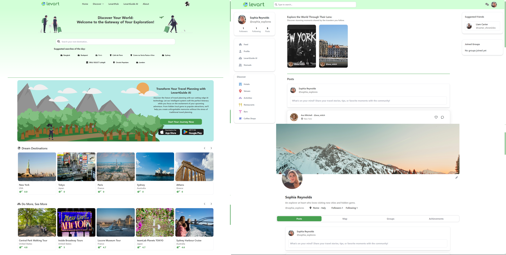

<div align="center">

  
  <h1>Levart - Beyond Destinations, Creating Memories</h1>
  
  <p>
   A social media web application based on travelling!
  </p>
  
   
<h4>
  <!--  <a href="https://github.com/Louis3797/awesome-readme-template/">View Demo</a>-->
  <!--<span> · </span>-->
    <a href="https://github.com/Louis3797/awesome-readme-template">Documentation</a>

  </h4>
</div>

<br />

<!-- Table of Contents -->
# :notebook_with_decorative_cover: Table of Contents

- [About the Project](#star2-about-the-project)
  * [Screenshots](#camera-screenshots)
  * [Tech Stack](#space_invader-tech-stack)
  * [Features](#dart-features)
  * [Environment Variables](#key-environment-variables)
- [Getting Started](#toolbox-getting-started)
  * [Run Locally](#running-run-locally)
- [License](#warning-license)

  

<!-- About the Project -->
## :star2: About the Project
This project was created for my thesis. Its goal is to combine the features of travel sites like TripAdvisor and Expedia with a social media aspect, making it more fun and engaging for users. It is a platform dedicated to travelers, allowing them to connect and share stories. This is a version of what a social media-based travel app could look like. Many features will be added in the future.


<!-- Screenshots -->
### :camera: Screenshots

<div align="center"> 
  
  <p>More screenshots in documentation</p>
</div>


<!-- TechStack -->
### :space_invader: Tech Stack

<details>
  <summary>Client</summary>
  <ul>
    <li><a href="https://reactjs.org/">React.js</a></li>
    <li><a href="https://tailwindcss.com/">TailwindCSS</a></li>
    <li><a href="https://www.heroui.com/">HeroUI</a></li>
  </ul>
</details>

<details>
  <summary>Server</summary>
  <ul>
    <li><a href="https://spring.io/projects/spring-boot">Spring Boot</a></li>
  </ul>
</details>

<details>
<summary>Database</summary>
  <ul>
    <li><a href="https://www.postgresql.org/">PostgreSQL</a></li>
  </ul>
</details>

<details>
<summary>Cloud</summary>
    <u>
        <li><a href="">Azure Storage browser</a></li>
    </u>
</details>


<!-- Features -->
### :dart: Features

- Chat one-on-one
- Create/Edit Posts
- Like/Comment posts
- Follow-Unfollow users
- Explore Destinations,Activities,Hotels and Venues
- Review Destinations,Activities,Hotels and Venues
- Suggest users to follow
- Create/Join Groups
- Change layout of profile and edit information.
- Login/Register
- Search
- Unlock achievements
- Interactive map to add visited cities.
- Plan trip with the use of AI from Google's Gemini API


<!-- Env Variables -->
### :key: Environment Variables

To run this project, you will need to create an .env file on the root directory and add the following environment variables to it.
Need an api key from: 
 - Gemini AI API: https://aistudio.google.com/
 - WeatherAPI: https://www.weatherapi.com/
 - Programmable Search Engine (if you want images to show with the AI result):
     - https://programmablesearchengine.google.com/controlpanel/create  
     - https://developers.google.com/custom-search/v1/introduction#identify_your_application_to_google_with_api_key

```
VITE_GEM_AI_API_KEY = ""
VITE_WEATHER_API_KEY = ""
VITE_GOOGLE_IMG_KEY = ""
```

<!-- Getting Started -->
## 	:toolbox: Getting Started

<!-- Run Locally -->
### :running: Run Locally

Clone the project

```bash
  git clone https://github.com/coccalis/Levart.git
```

Go to the project directory for front-end

```bash
  cd Levart/levart-frontend
```

Install dependencies

```bash
  npm install
```

Start the server

```bash
  npm run dev
```
For the backend open the folder levart-backend on the IntelliJ IDEA Ultimate

<!-- License -->
## :warning: License

Distributed under the no License.


<!-- Contact -->
## :handshake: Contact

Chris Kokkalis- kokkalischrisbs@gmail.com
